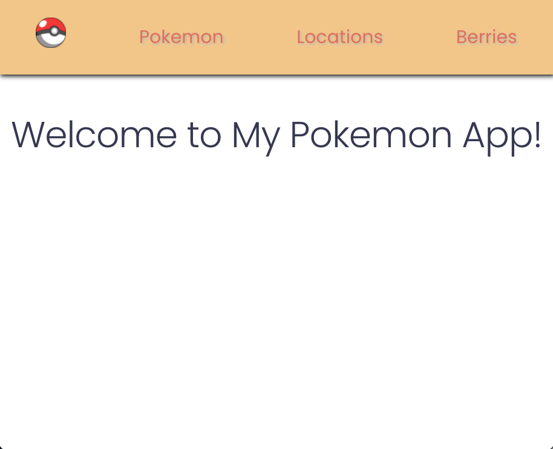
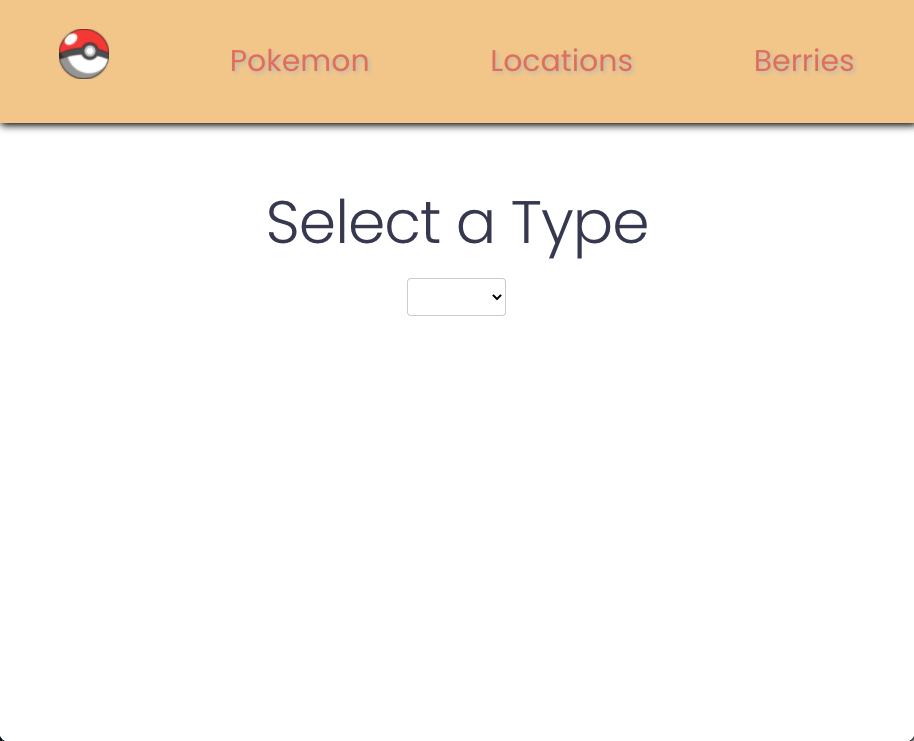
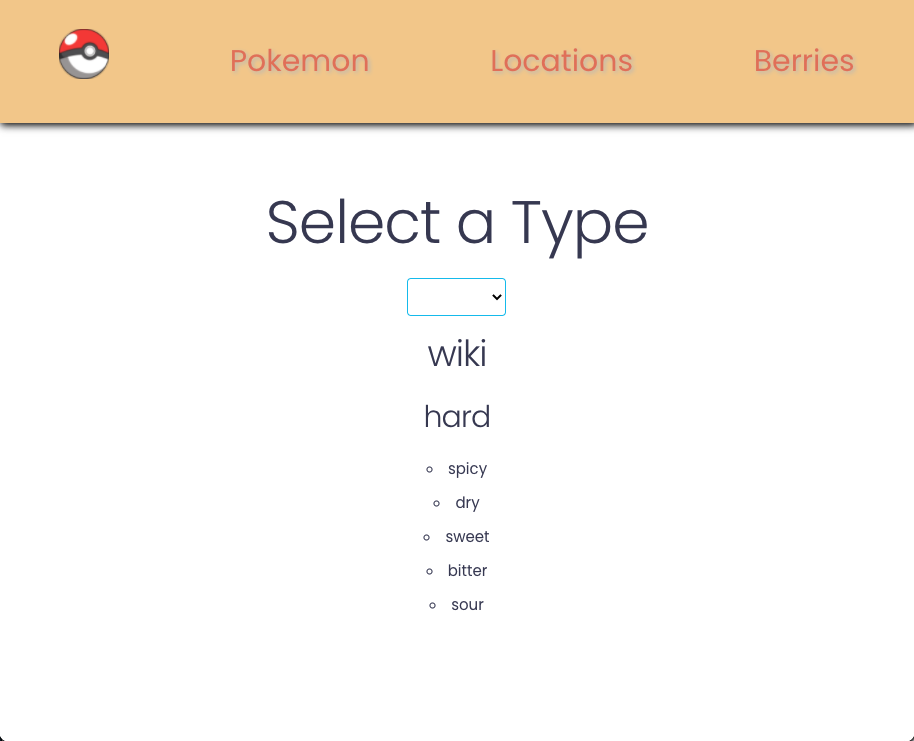
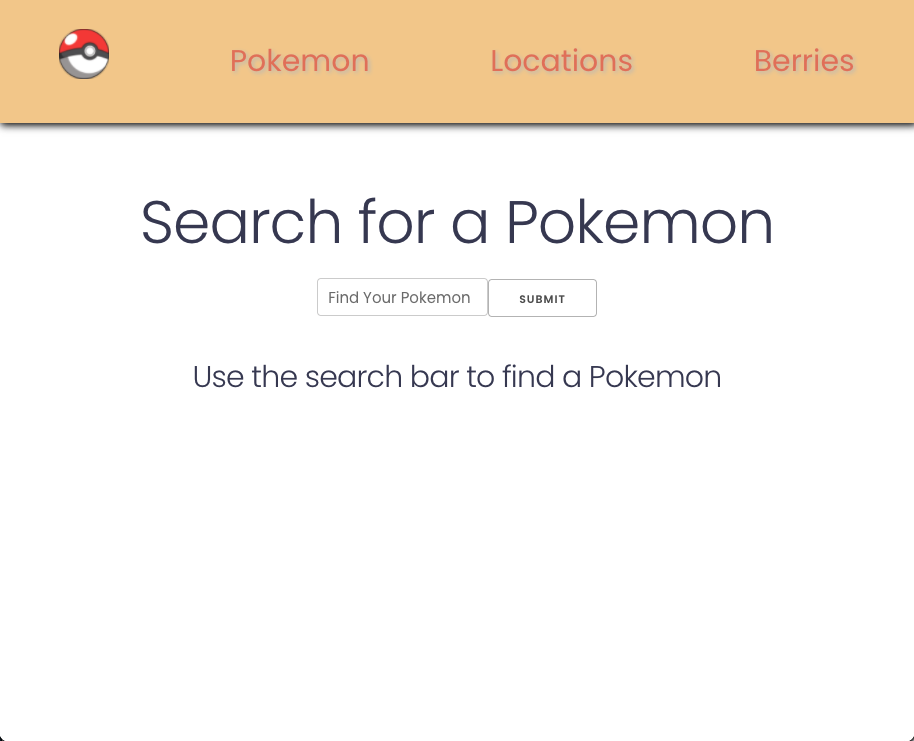
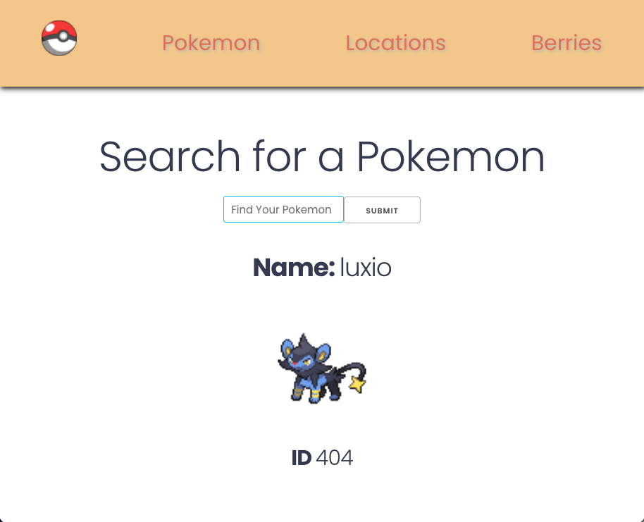
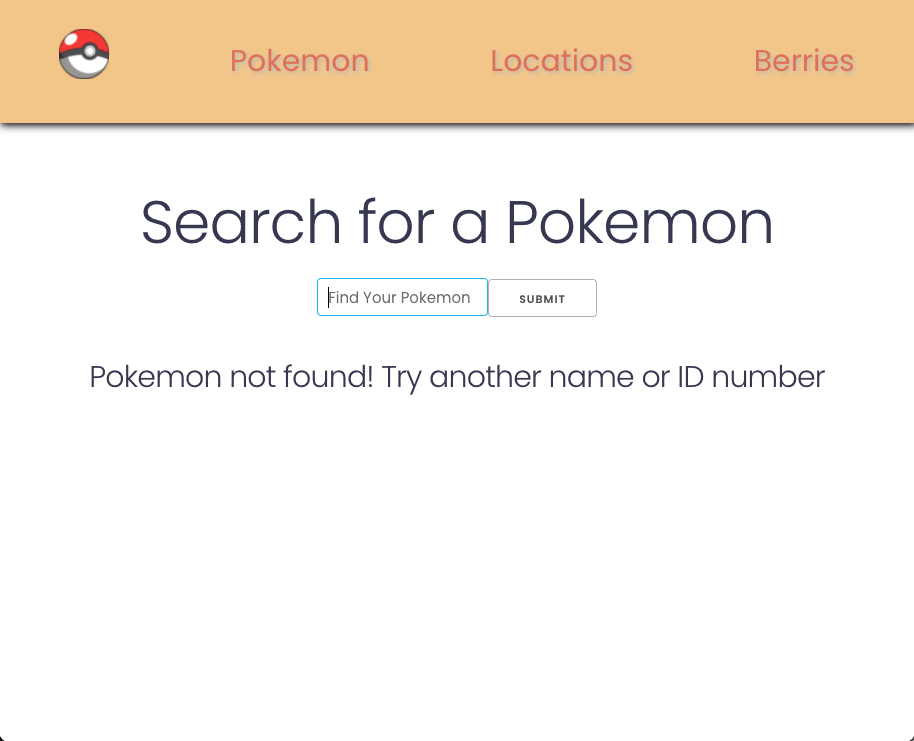
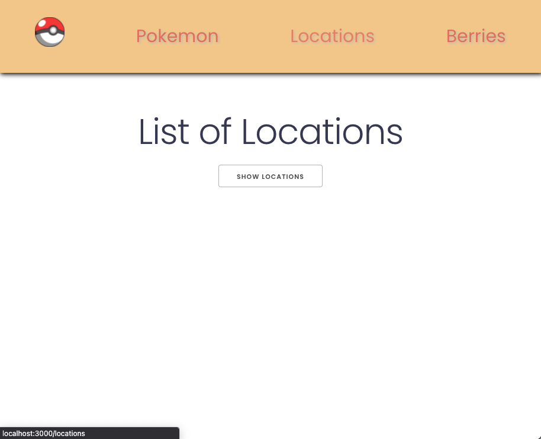
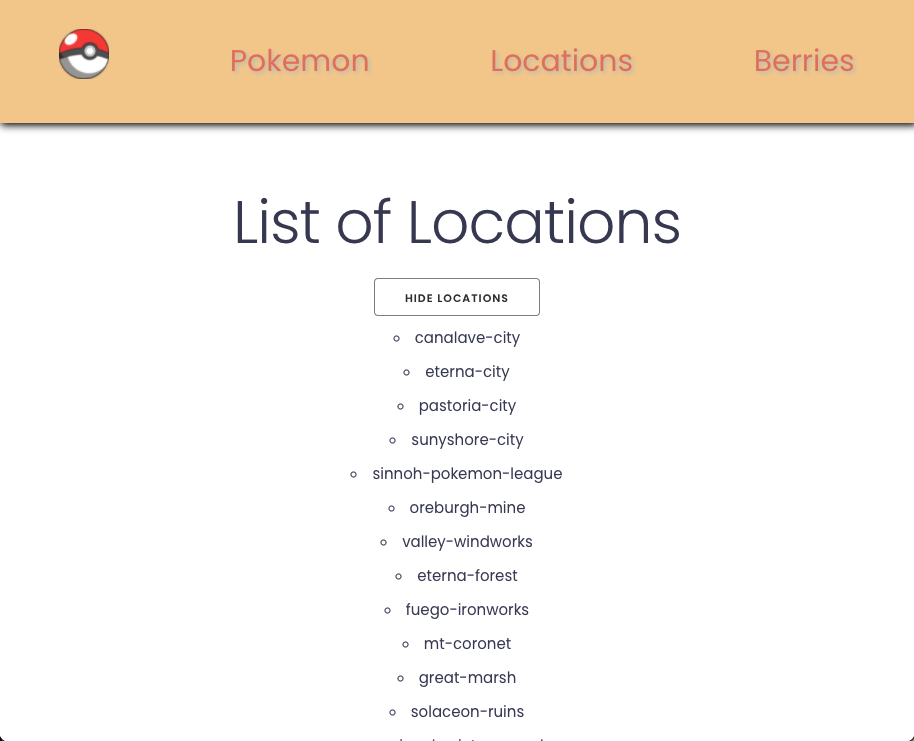

# Module Three Practice Assessment

## Getting Started

- Fork this repo
- Clone the forked repository
- `cd` to the directory where you cloned it
- `npm install` to install dependencies
- `npm start` to start the react app on `localhost:3000`
- `npm run cypress` (in a separate terminal tab) to open the cypress testing window

> _Note_: Remember to `git add`, `git commit` and `git push` regularly

Using the [PokéApi](https://pokeapi.co/), you are going to create a frontend-only app.

#### Nav Bar

At the top of your app you should have a navigation bar.

- It displays links to each primary route ("/pokeman", "/locations", "/berries") at the top of the page, in a row, with space-around.

- Includes a logo of your choosing (50px x 50px), displayed in the upper-left of the page.
  The logo and links should display on every page.
  The logo should link to the homepage ("/").

Your app should also include the following routes:

### `/`

Includes a centered header with the text "Welcome to My Pokemon App!". 

### `/berries`

- Displays the header "Select a Type" above a dropdown menu, centered.
- The dropdown menu should display a list of the berries available at `https://pokeapi.co/api/v2/berry/` (this will give the first 20 berries, by default).
- When a berry is chosen from the dropdown menu, the
  - `name`
  - `firmness`
    should display below it.
- **CHALLENGE - NOT REQUIRED** show a list of `flavor.flavor.name`
- In this route, there should be no "Submit" button.
- Selection from the dropdown menu should submit the user's input automatically.
- New inputs should replace the previously displayed information.
   

### `/pokemon`

- Displays the header "Search for a Pokemon" above a text input with an input type `submit`.
- When a user inputs text and presses "submit"
  - `name`
  - `sprites.front_default`
  - `id`
  - **CHALLENGE - NOT REQUIRED** _Look through the JSON data and try to add more information below_

of the character should appear below.

- The input will accept an id or full name (no need for partial matches)
- If the user's input does not match a name or id (misspelled or otherwise), the text "Pokemon not found! Try another name or ID number" should display below the input.
- The input should clear once the "submit" button is pressed.
- New inputs should replace the previously displayed information.

 

### `/locations`

- Displays a header
- centered on the page
- with the text "List of Locations".
- Display a button that toggles back and forth between "Show Locations" and "Hide Locations".
- When show locations has been selected, it displays an unordered list of all of the locations retrieved at `https://pokeapi.co/api/v2/location`, centered on the page.
- Each location should include the `name`
   

Afterwards, you should work on styling:

Import two fonts (of your choosing) from Google Fonts. The first font should be the font you use for header text and the second one should be for input/body/search result text.
Define unique colors (of your choosing) for each page's background.

Remember to install your packages correctly so that we will be able to run / compile your app by running npm install, npm start.

Your app should also have a **clean** console. We don't want to see you Warnings, Errors, or Logs.
